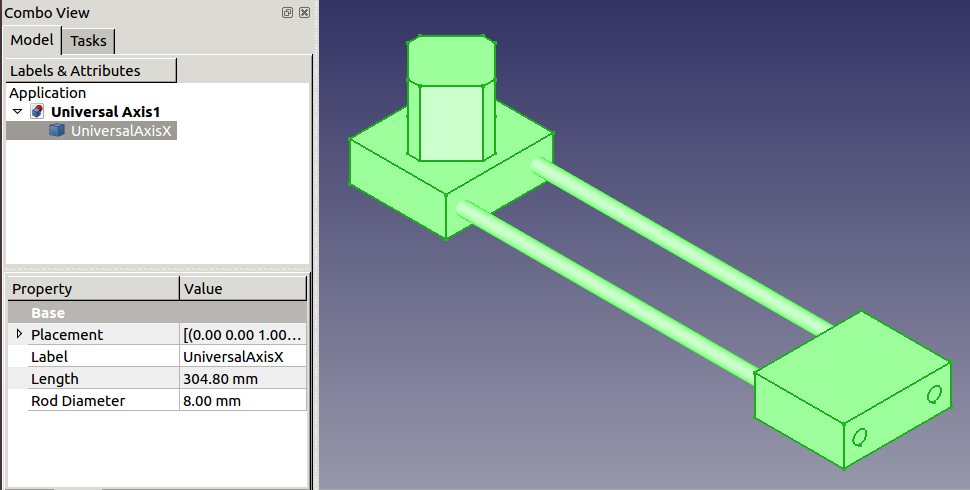

# OSE Universal Axis Macro
The [Universal Axis](https://wiki.opensourceecology.org/wiki/Universal_CNC_Axis) is a modular and scalable CNC axis for creating cartesian CNC machines.

This FreeCAD macro creates Universal Axis objects allowing the user to adjust properties like `Length` automatically.



## Setup
1. Clone the repository
2. Link the macro to your FreeCAD macro directory by running the `link_macro.sh` shell script:

```
./link_macro.sh
```